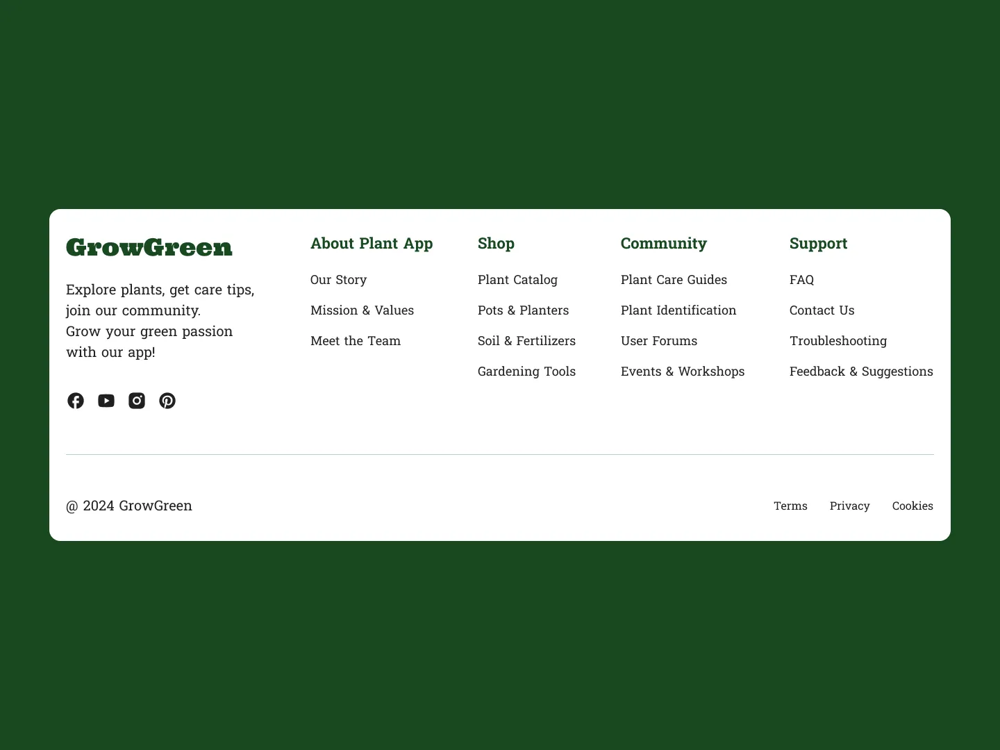

# Challenge Name: Footer

You can work on this challenge directly in [BigDevSoon Code Editor](https://app.bigdevsoon.me/challenges/footer/browser).

## Introduction

As a user, I want to easily subscribe to travel-related content through a visually appealing subscription form, so I can receive exclusive travel perks, tips, and experiences directly in my inbox.

## User Story

As a user, I want to navigate the footer of the website easily, so I can access different sections related to the app, shop, community, and support.

## Acceptance Criteria

- The footer displays the GrowGreen brand logo and a brief tagline.
- Four main sections are available: About Plant App, Shop, Community, and Support.
- Each section contains links to relevant pages such as "Our Story," "Plant Catalog," and "Contact Us."
- Social media icons are present and link to the corresponding platforms.
- The footer includes standard legal links: Terms, Privacy, and Cookies.
- Copyright information is displayed at the bottom.

## Get Started

Begin your development with the `index.html` provided in the challenge's folder. You can work on this challenge directly in the [BigDevSoon Code Editor](https://app.bigdevsoon.me/challenges/footer/browser) and use the assets available to you and refer to the design screenshot for visual guidelines. Push your boundaries and remember, perfection comes through practice and iteration.

## Best Practices and Tips

- Design Accuracy: Your solution should closely match the layout and style of the provided screenshot.
- Interactivity: Enhance user interaction through JavaScript to elevate the experience beyond a static display.
- Functionality: Ensure that all elements are functional, with attention to detail in the implementation.
- Quality Assurance: Submit a well-coded, clean, and organized solution that adheres to modern web standards.
- Code Quality: Write clean, readable, and well-commented code to maintain best practices in development.
- Responsive Design: Ensure your challenge solution is responsive and functions well on various devices.
- Performance Optimization: Optimize image sizes and script efficiency to improve the loading times and responsiveness of your code.
